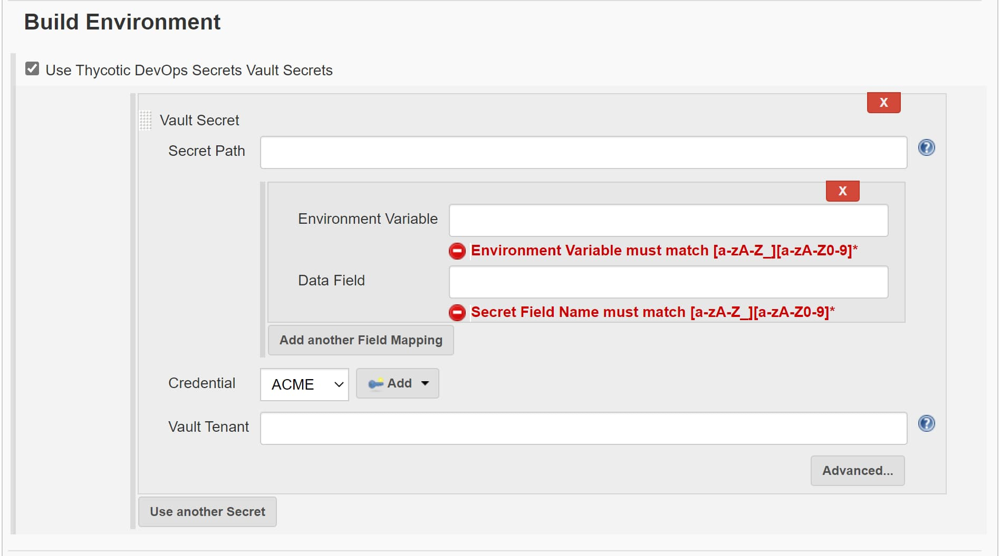
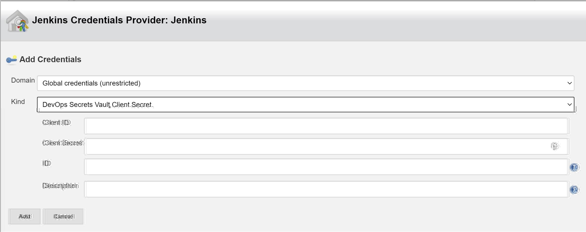

# Thycotic DevOps Secrets Vault

The Thycotic DevOps Secrets Vault (DSV) Jenkins Plugin allows you to access and reference your Secrets data available for use in Jenkins builds.

## Usage

This plugin add the ability to include Secret data into your build environment.

This is allows you to include the `Vault Tenant` of your DevOps Vault, along with the `Secret Path` of the secret data you wish to access.

Additionally you will need to include a valid credential provider.

You will now have the option to change the `kind` of credential you wish to add, to that of a `DevOps Secrets Vault Client Secret`.

After you have added your credentials to the build environment you can use the secret in your build/s.

## Release notes

### 1.0-SNAPSHOT

- Initial release
